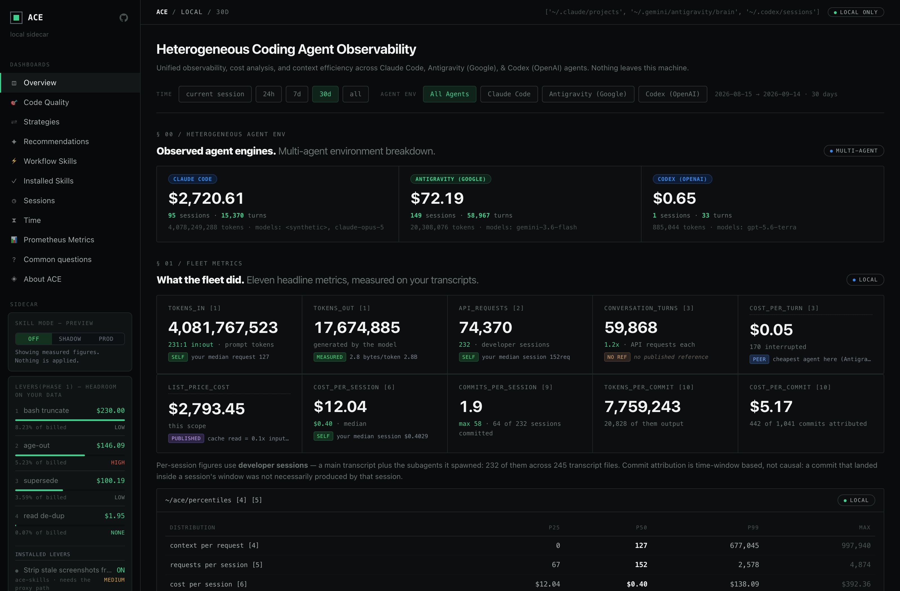
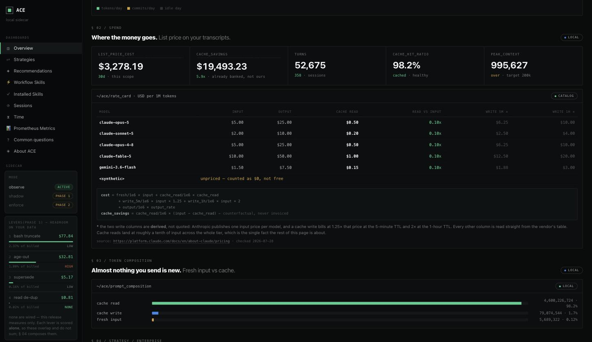
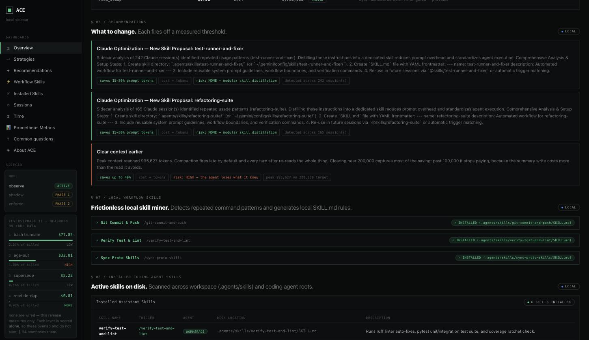
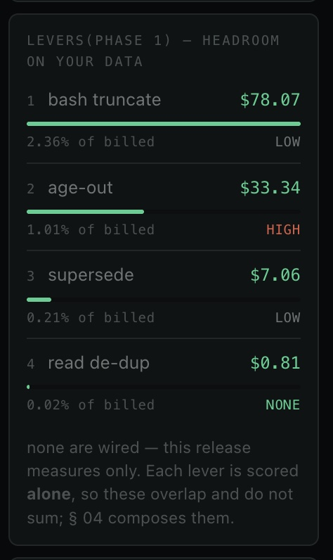
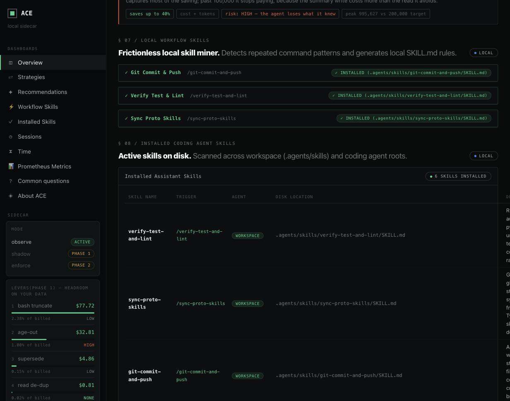
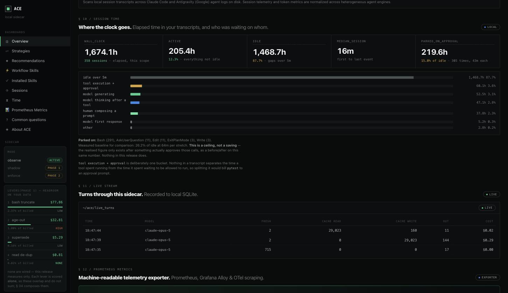
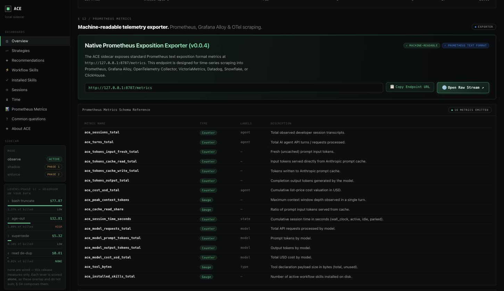

# ACE Sidecar

Local developer observability for AI coding agents — see what your Claude Code, Antigravity, and OpenAI Codex sessions actually cost.

[](https://github.com/ACE-Engineering/ace-sidecar/actions/workflows/ci.yml)
[](https://pypi.org/project/ace-sidecar/)
[](https://pypi.org/project/ace-sidecar/)
[](LICENSE)



**[What it does](#what-it-does)** · **[Requirements](#requirements)** · **[Install](#install)** · **[Check Version](#check-version)** · **[Upgrade](#upgrade)** · **[Quickstart](#quickstart)** · **[Features](#features)** · **[Who builds this](#who-builds-this)** · **[Configuration](#configuration)** · **[Endpoints](#endpoints)** · **[Development](#development)** · **[License](#license)**

---

## What it does

ACE Sidecar runs a proxy on your machine in front of model providers, recording what each turn costs — tokens in and out, what came from cache, how long you waited. It automatically reads your existing local transcripts (`~/.claude/projects`, `~/.gemini/antigravity/brain`, `~/.codex/sessions`), providing unified history and cost tracking from the first run.

Nothing leaves your machine: no account, no upload. Metrics live in a local SQLite file you can delete anytime.

Built by [ACE Fleet](https://acefleet.dev) — see [Who builds this](#who-builds-this).

---

## Requirements

- **Python 3.12+** — the one hard requirement. Check with `python3 --version`.
- macOS, Linux, or Windows. No admin rights needed.
- **A coding agent you already use.** Claude Code, Google Antigravity, and OpenAI Codex are supported. However you pay for it — subscription or API key — is how it stays paid; the sidecar adds no account of its own.

Need a newer Python? `brew install python@3.12` (macOS), `sudo apt install python3.12` (Debian/Ubuntu), `sudo dnf install python3.12` (Fedora), [python.org](https://www.python.org/downloads/) (Windows), or `uv python install 3.12` (anywhere).

---

## Install

### Option A: Via `uv` (Recommended & Fastest)
```bash
uv tool install ace-sidecar
```

### Option B: Via `pipx`
```bash
pipx install ace-sidecar
```

### Option C: Via `pip` (in a virtual environment)
```bash
python3.12 -m venv ~/.venvs/ace && source ~/.venvs/ace/bin/activate
pip install ace-sidecar
```

### Option D: Direct from GitHub or Local Source
```bash
# From GitHub release tag
uv tool install git+https://github.com/ACE-Engineering/ace-sidecar.git@v0.2.0

# From cloned repository (editable for local development)
uv tool install --editable .
```

---

## Check Version

Check which version of `ace-sidecar` is currently installed on your system:

| Tool | Command | Expected Output |
| :--- | :--- | :--- |
| **`uv`** | `uv tool list` | `ace-sidecar v0.2.0` |
| **`pip`** | `pip show ace-sidecar` | `Version: 0.2.0` |
| **`pipx`** | `pipx list` | `package ace-sidecar 0.2.0` |
| **Python** | `python3 -c "import importlib.metadata; print(importlib.metadata.version('ace-sidecar'))"` | `0.2.0` |

---

## Upgrade

To upgrade an existing installation to the latest release:

```bash
# With uv
uv tool upgrade ace-sidecar
# (or force fresh index): uv tool install --force --reinstall --refresh ace-sidecar

# With pipx
pipx upgrade ace-sidecar

# With pip
pip install --upgrade ace-sidecar
```

### Troubleshooting
- **`Could not find a version that satisfies the requirement ace-sidecar`**: Your active Python is older than 3.12. Check `python3 --version`.
- **`ace: command not found`**: Run `uv tool update-shell` or `pipx ensurepath`, then restart your terminal.

---

## Quickstart

Start the sidecar and open the dashboard:

```bash
ace up
open http://127.0.0.1:8787/dashboard
```

Use your coding agents as normal (**Claude Code**, **Google Antigravity**, or **OpenAI Codex**) — existing and new sessions appear automatically, with historical transcripts, token counts, and spend calculations loaded directly from disk.

---

## Features

**Unified view across agents.** Claude Code and Antigravity in one place, with per-agent cost, sessions, turns and models. Pick one agent and the page scopes to it.

**Real spend against published prices.** Per-turn cost from a versioned rate catalog — input, output, cache-read, and derived cache-write rates — with the source and the date it was checked. Cache savings shown as a counterfactual.



**Recommendations off a measured threshold.** Each one fires on a number from your own transcripts and carries its saving, its cost, and its risk.



**Optimisation levers, ranked by what they are worth to you.** The rail orders every lever by the money it would recover on your transcripts, with the share of your bill and the risk beside it. Each is scored alone, so the figures overlap and do not sum — and none are wired yet: this release measures.



**Workflow skill miner.** Repeated command sequences become reusable `SKILL.md` rules, installable into `.agents/skills/<id>/` in one click.



**Where the time goes.** Wall clock split across model generating, tool execution, human composing, and idle — including time parked on approval prompts.



**Prometheus exporter.** 15 metrics in standard text exposition format at `GET /metrics`, for Prometheus, Grafana Alloy, OpenTelemetry Collector, VictoriaMetrics, or Datadog. See [docs/PROMETHEUS_METRICS.md](docs/PROMETHEUS_METRICS.md).



---

## Who builds this

ACE Sidecar is built by **[ACE Fleet](https://acefleet.dev)**.

ACE Fleet is a middleware proxy for companies scaling AI applications. It sits between their services and the model providers and reduces what they spend on inference as that usage grows — across every workload in the business, not one team's tooling. That is the product.

This sidecar is one vertical of it, open-sourced on its own: the same accounting, pointed at a single developer's coding agents.

| | **ACE Sidecar** (this repo) | **ACE Fleet** |
|---|---|---|
| **Scope** | One developer's machine | An organisation's whole inference bill |
| **Workload** | Coding agents — Claude Code, Antigravity | Any AI application in production |
| **What it does** | **Measures.** Records and explains the spend | **Acts.** Reduces the spend in the request path |
| **Where it runs** | Loopback on your machine; nothing leaves it | Managed middleware between your services and the providers |
| **License** | Open source, AGPL-3.0 | Commercial |

The two answer different questions. The sidecar answers *where is my money going* on the machine in front of you, at a scale small enough to check by hand. Fleet answers *what do we do about it* once that question is being asked of an entire company's traffic.

Open-sourcing the coding-agent slice is deliberate: it is the part a developer can run in one command, on their own data, without talking to anyone — and the clearest way to show how the larger system reasons about cost. If it is useful at your desk, [we would like to hear about it](mailto:contact@acefleet.dev).

---

## Configuration

Settings resolve in order: **CLI flags** → **`~/.ace/config.json`** → **environment variables** → **defaults**.

```json
{ "no_key": true, "port": 8787, "log_level": "warning" }
```

| Path | Holds |
|---|---|
| `~/.ace/telemetry.db` | Turn telemetry — local SQLite, never uploaded |
| `~/.ace/config.json` | Your settings |
| `~/.claude/projects`, `~/.gemini/antigravity/brain`, `~/.codex/sessions` | Agent transcripts — read only |

Delete `~/.ace/` to remove everything recorded.

## Endpoints

| Endpoint | Purpose |
|---|---|
| `POST /v1/messages` | The relay your agent talks to |
| `GET /dashboard` | The dashboard above |
| `GET /healthz` | Liveness and config state, without leaking your key |
| `GET /api/stats` | The dashboard's numbers as JSON |
| `GET /metrics` | Prometheus exposition |

Binds loopback and refuses non-local callers; a public bind needs `--allow-remote`.

---

## Development

```bash
git clone https://github.com/ACE-Engineering/ace-sidecar.git && cd ace-sidecar
python3.12 -m venv .venv && source .venv/bin/activate
pip install -e ".[test]"

pytest                        # 40 unit tests
python scripts/e2e_test.py    # live route verification
```

---

## License

[GNU Affero General Public License v3.0](LICENSE).
